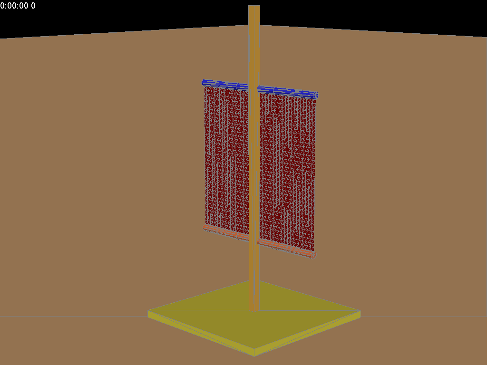
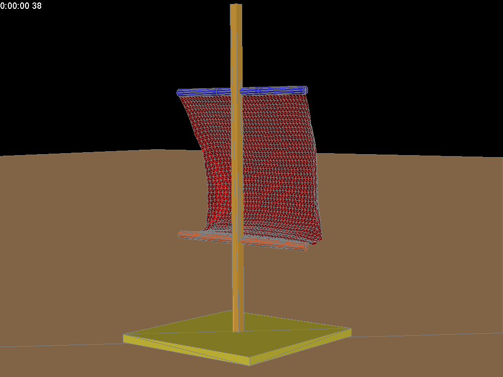
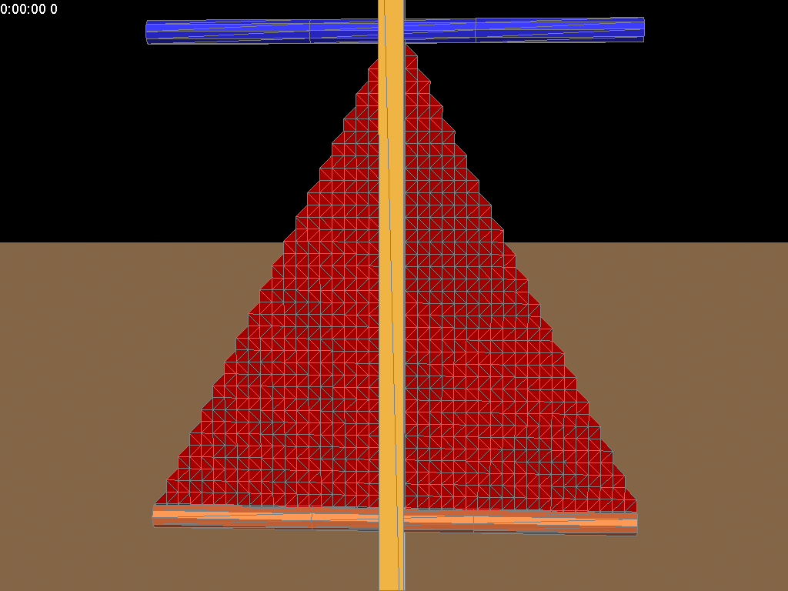
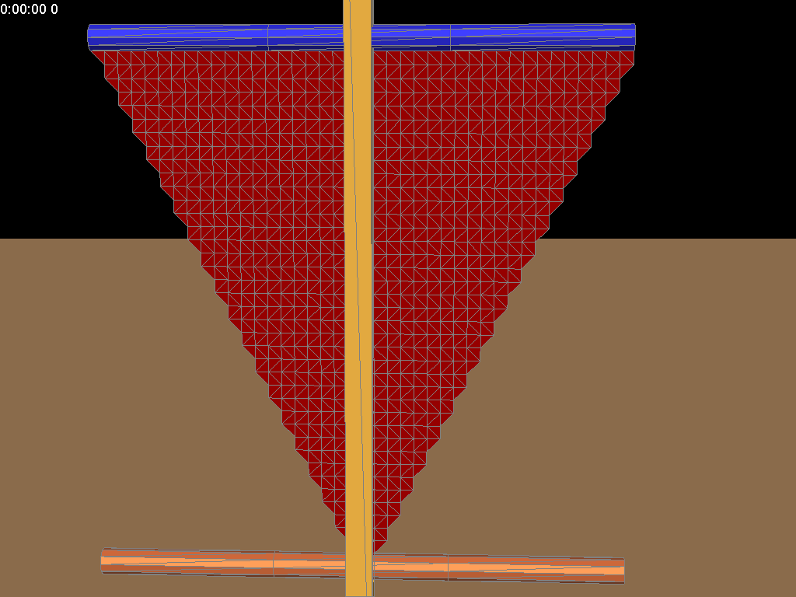

Sailing
=======
There are three cases.

###  case 1. equal_length cloth sail

###  case 2. small_top cloth sail

###  case 3. small_bottom cloth sail

The corresponding animation showed in the folder.

