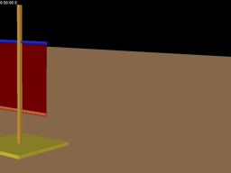
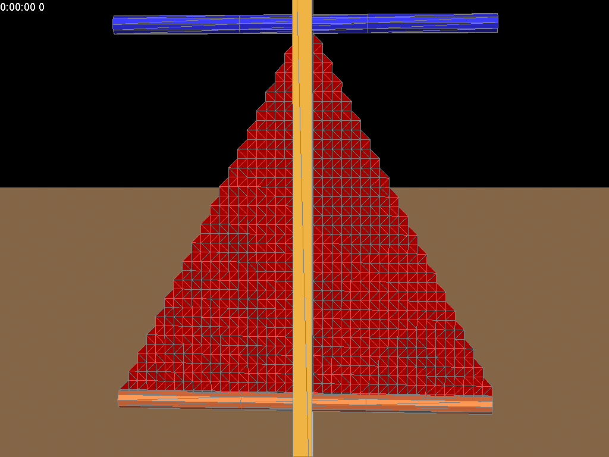
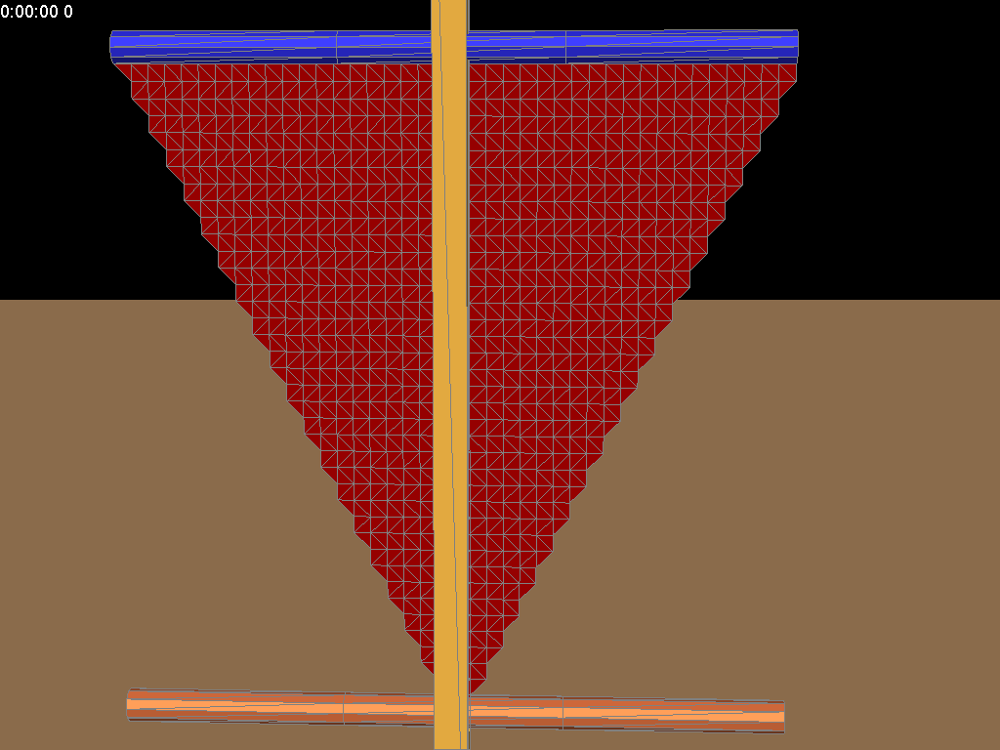

Sailing
=======
There are three cases.

###  case 1. equal_length cloth sail
<video id="equalLength" class="video-js vjs-default-skin" controls
preload="auto" width="683" height="384" poster="/figure&video/equalLength.png"
data-setup="{}">
<source src="/figure&video/equalLength.avi" type='video/avi'>
</video>

###  case 2. small_top cloth sail

###  case 3. small_bottom cloth sail

The corresponding animation showed in the folder.

