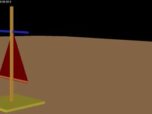
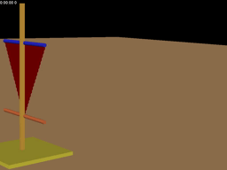

Sailing
=======
There are three cases and the corresponding preview animation (the full animations are described by .avi in the `figure&video` folder).

###  case 1. equal_length cloth sail

###  case 2. small_top cloth sail

###  case 3. small_bottom cloth sail

